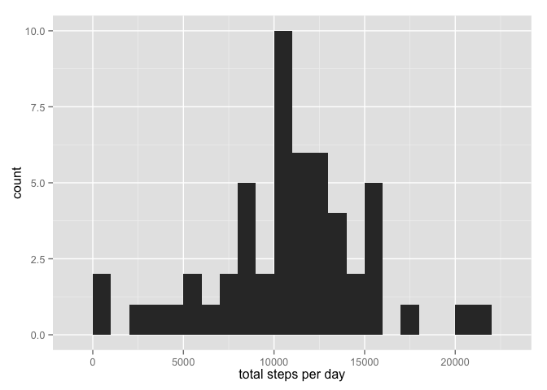
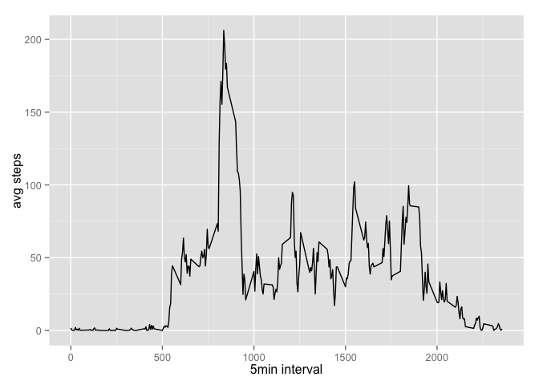
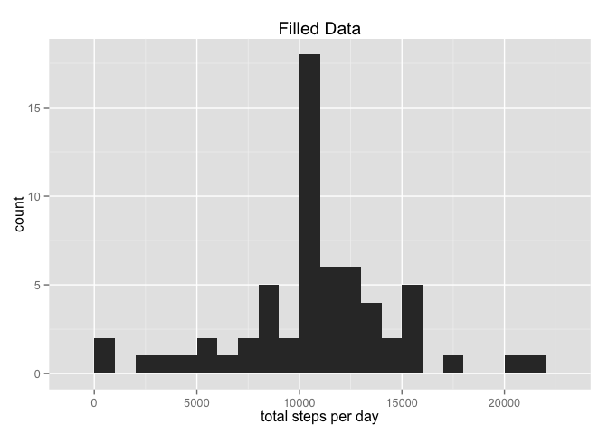
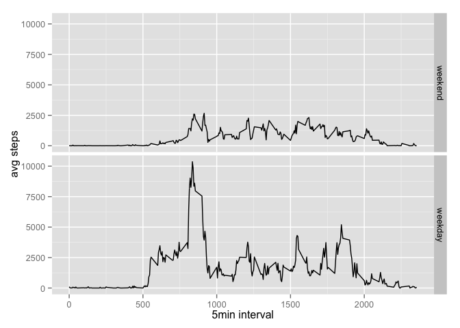

# Reproducible Research: Peer Assessment 1


## Loading and preprocessing the data

Cloned GitHub repository <http://github.com/rdpeng/RepData_PeerAssessment1>  

```r
setwd("~/Box Sync/Programming/Coursera - Data Science/5.0 Reproducible Research/RepData_PeerAssessment1")  #mac
#setwd("C:/Users/steven.aurousseau/Box Sync/Programming/Coursera - Data Science/5.0 Reproducible Research/RepData_PeerAssessment1")
unzip("activity.zip")
list.files()
```

```
##  [1] "activity.csv"                                  
##  [2] "activity.zip"                                  
##  [3] "doc"                                           
##  [4] "instructions_fig"                              
##  [5] "PA1_template (steven.aurousseau@gmail.com).Rmd"
##  [6] "PA1_template_2015-09-16.Rmd"                   
##  [7] "PA1_template_files"                            
##  [8] "PA1_template.html"                             
##  [9] "PA1_template.md"                               
## [10] "PA1_template.Rmd"                              
## [11] "README.md"
```

Load data, check dataframe size and class and look at top rows.

```r
data <- read.csv("activity.csv")
dim(data)
```

```
## [1] 17568     3
```

```r
head(data)
```

```
##   steps       date interval
## 1    NA 2012-10-01        0
## 2    NA 2012-10-01        5
## 3    NA 2012-10-01       10
## 4    NA 2012-10-01       15
## 5    NA 2012-10-01       20
## 6    NA 2012-10-01       25
```

```r
str(data)
```

```
## 'data.frame':	17568 obs. of  3 variables:
##  $ steps   : int  NA NA NA NA NA NA NA NA NA NA ...
##  $ date    : Factor w/ 61 levels "2012-10-01","2012-10-02",..: 1 1 1 1 1 1 1 1 1 1 ...
##  $ interval: int  0 5 10 15 20 25 30 35 40 45 ...
```

## What is mean total number of steps taken per day?

1. Calculate the total number of steps taken per day

```r
total <- aggregate(steps ~ date, data = data, sum, na.rm = TRUE)
head(total)
```

```
##         date steps
## 1 2012-10-02   126
## 2 2012-10-03 11352
## 3 2012-10-04 12116
## 4 2012-10-05 13294
## 5 2012-10-06 15420
## 6 2012-10-07 11015
```

2. Make a histogram of the total number of steps taken each day

```r
library(ggplot2)
qplot(total$steps, geom="histogram", binwidth=1000, xlab="total steps per day")
```

 

3. Calculate and report the mean and median of the total number of steps taken per day

```r
mean(total$steps, na.rm=TRUE)
```

```
## [1] 10766.19
```

```r
median(total$steps, na.rm=TRUE)
```

```
## [1] 10765
```

## What is the average daily activity pattern?

1. Make a time series plot (i.e. type = "l") of the 5-minute interval (x-axis) and the average number of steps taken, averaged across all days (y-axis)

```r
avg.steps <- aggregate(steps ~ interval, data = data, mean, na.rm = TRUE)
with(avg.steps, qplot(interval, steps, geom="line", ylab="avg steps", xlab="5min interval"))
```

 

2. Which 5-minute interval, on average across all the days in the dataset, contains the maximum number of steps?

```r
avg.steps[which.max(avg.steps$steps), ]
```

```
##     interval    steps
## 104      835 206.1698
```

## Imputing missing values

1. Calculate and report the total number of missing values in the dataset (i.e. the total number of rows with NAs)


```r
sum(is.na(data))
```

```
## [1] 2304
```

2. Devise a strategy for filling in all of the missing values in the dataset. The strategy does not need to be sophisticated. For example, you could use the mean/median for that day, or the mean for that 5-minute interval, etc.

    Will fill missing values with the mean (for all 61days) for the corresponding 5 minute interval.

3. Create a new dataset that is equal to the original dataset but with the missing data filled in.


```r
data.fill <- data
data.fill$avg <- avg.steps$steps
data.fill$steps[is.na(data.fill$steps)] <- data.fill$avg[is.na(data.fill$steps)]
data.fill$avg <- NULL
```

4. Make a histogram of the total number of steps taken each day and Calculate and report the mean and median total number of steps taken per day. Do these values differ from the estimates from the first part of the assignment? What is the impact of imputing missing data on the estimates of the total daily number of steps?

Calculate the total number of steps taken per day

```r
total.fill <- aggregate(steps ~ date, data = data.fill, sum)
```

Make a histogram of the total number of steps taken each day

```r
qplot(total.fill$steps, geom="histogram", binwidth=1000, xlab="total steps per day", main="Filled Data")
```

 

Calculate and report the mean and median of the total number of steps taken per day

```r
mean(total.fill$steps)
```

```
## [1] 10766.19
```

```r
median(total.fill$steps)
```

```
## [1] 10766.19
```

The mean is unchanged from the unfilled data set, while the median is now higher and equal to the mean. This is a result of forcing the missing values to to the mean of the 5min periods. The impact of imputing the values of the total number of steps was to force the data to look more like the strategy that was applied. In this case the strategy for filling the data was the mean for the period, consequently the filled data is biased towards that mean.   


## Are there differences in activity patterns between weekdays and weekends?

For this part the weekdays() function may be of some help here. Use the dataset with the filled-in missing values for this part

1. Create a new factor variable in the dataset with two levels - "weekday" and "weekend" indicating whether a given date is a weekday or weekend day.


```r
weekend <- c("Saturday", "Sunday")
data.fill$weekend <- factor(weekdays(as.POSIXct(data.fill$date)) %in% weekend, 
                     levels=c(TRUE, FALSE), labels=c("weekend", "weekday"))
```

2. Make a panel plot containing a time series plot (i.e. type = "l") of the 5-minute interval (x-axis) and the average number of steps taken, averaged across all weekday days or weekend days (y-axis). See the README file in the GitHub repository to see an example of what this plot should look like using simulated data.


```r
total.weekend <- aggregate(steps ~ interval + weekend, data = data.fill, sum)
qplot(interval, steps, data = total.weekend, facets = weekend ~., geom = "line",
      ylab="avg steps", xlab="5min interval")
```

 


